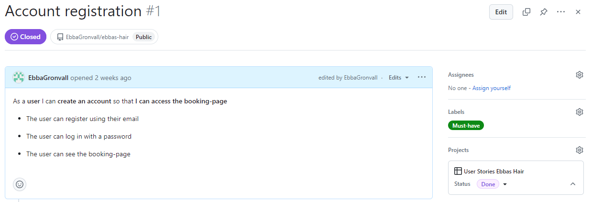
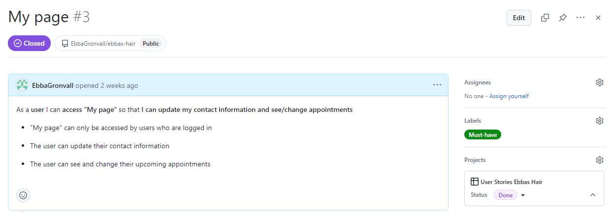
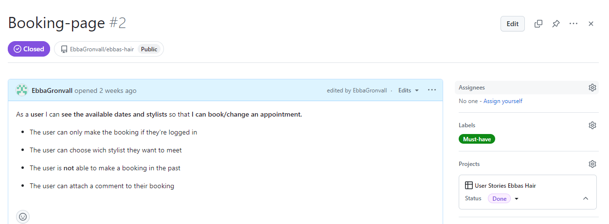
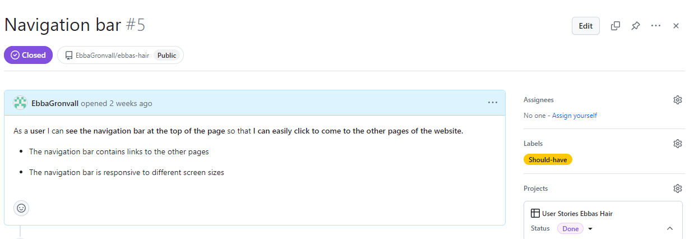
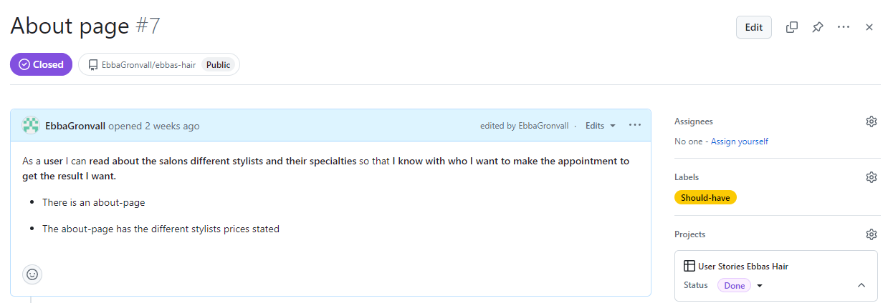
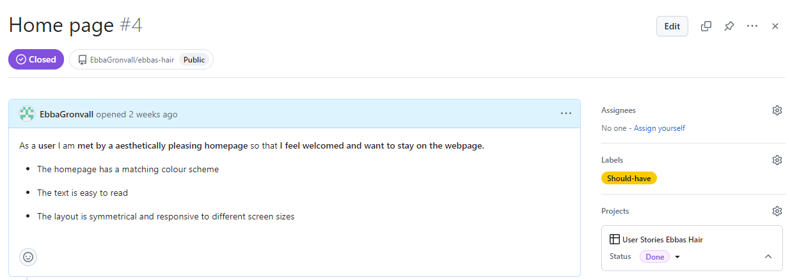
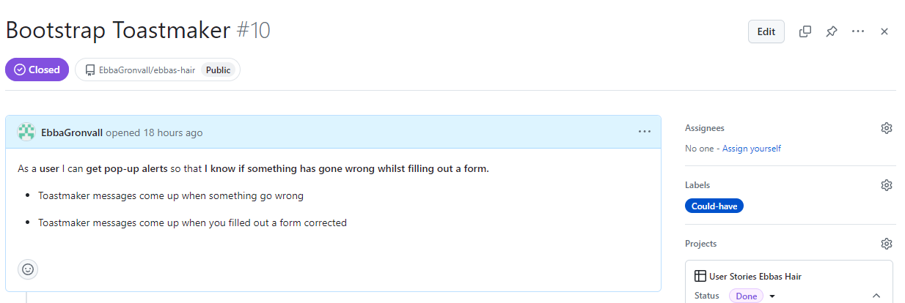
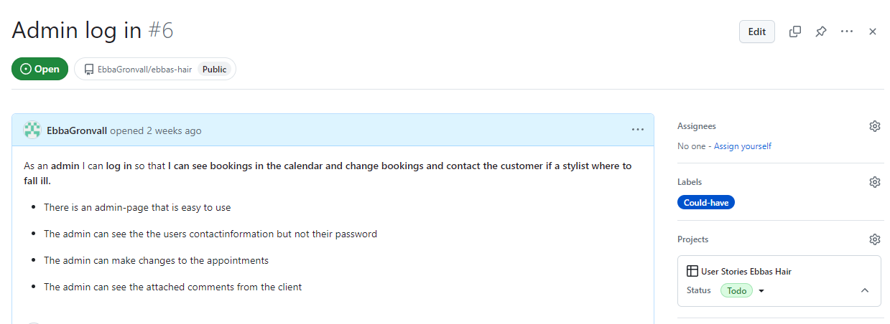
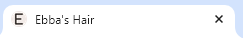
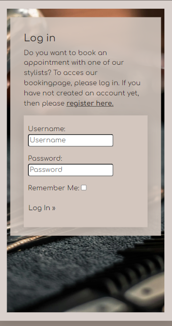

# Ebba's Hair

Ebba's Hair is a website for a hair salon called "Ebba's Hair". It has a page where the user can read more about the stylists who are available for bookings and the different services they offer. There user is also able to find information about where the salon is located, their phonenumber and their email-address. The user is also able to book an appointment online.

Ebba's Hair is not a real salon so the contact information and the stylists are fictional and just for the sake of this website.

## The website on different screensizes

Since I have used Bootstrap container, rows and collumns, an expandable navbar and % width on images the website adapts beautifully to different screensizes.

## The Color Scheme

For this project I choose five shades of a brownish grey color that I used across the whole website.

## The Font

I used the Google Font "Comfortaa" for all the text found on the website. It suited my vision best.

## User stories
Before writing any code I sat down and wrote down the user stories. I used the 'Projects' tab in github to do this. I created a custom issues template and labels called: Must-have, Should-have, Could-have and Won't-have. When I had written down all my user stories I had nine. Three where 'Must-have', three was 'Should-have' and the remaining three were 'Could-have'. Out of these nine seven are done and closed. The two remaining are 'Could-have' and will be implemented in the future. 

### Must-have
The 'Must-have' for Ebba's Hair was: Account registration, My page and Booking-page.

### Should-have
The 'Should-have's were: Navigation bar, About page and Home page.

### Could-have
The 'Could-have's for this website were: Bootstrap Toastmaker, Custom errorpages and Admin log in. The Bootstrap Toastmaker issue is the one that is done. The custom errorpages and the admin page will be added at a later time as they are not crutial to the project as they are 'Could-have's.

## Features

### Favicon

In the tab for the website there is a custom made favicon with the same font and color scheme as the rest of the website. 

### Navigation Bar

The navigationbar contains links to all the different pages depending on if you are authorized or not. When the screen width is under 992px the unorderd list becomes a dropdown menu with a toggle button to the right of the header. 

There are bootstrap classes called 'nav-link' and 'active'(if the url is active) on all the links in the navigationbar that increases the opasity of the color of the text when hovering over and for when a page is active.

The navbar on different devices when the user is not authorized.

The navbar on different devices when the user is authorized.

A gif that shows how the navbar reacts to the user hovering over the page links.

 

### Header

The header of the page is only visible on the homepage and the aboutpage. This is purely for aestetich reasons.

### Homepage

The homepage contains a welcoming message that tells the user to come in and relax. The user can also see their opening hours and their contact information. The address for the salon is a link to the address on Google Maps.

### Aboutpage

On the aboutpage the user can read more about the salons different stylists. They can also see the stylists speciality and their price. The data for the aboutpage comes from the custom model called StylistList. The stylists are added to the page using a for loop in the template. This for loop is inspired by the 'Thorin and his company' flask walkthrough project. The admin can add new stylists or mark stylists as inactive using the django admin page to hide them from the aboutpage. 

### Register

The register page is a allauth django model, form and template. The user is asked to fill in their email address, the username they want and a password that fullfills the criteria stated. The user is then asked to repeat the password to confirm it before they will click on the submit button bellow to register as a user.

Bellow the form there is a paragraph saying that if they already have an account they can follow the link in "Sign in here!" to get to the log in page.

If the user where to forget to fill out a field they will get an alert that tells them that they need to fill out for example the email address field. The user will also get an alert if they enter an email address without an @ in it.

If the user tries to register with an email thats already connected or a username that is already taken they will be informed of this and asked to change it.

Bellow you can see a register form filled out successfully. The user is redirected to the homepage and notice how the navbar changes due to the user being authorized.

### Log in page

The log in page is just like the register page a allauth django model, form and template. At the top of the page there is a message that explains that the user needs to be authorized for them to be able to book an appointment. There is also a link to the register page if the user does not have an account yet. 

The form contains a field for the username and a password field. The user can also check the box asking to be remembered. 

If the user enters the wrong username or password they get a message telling them that it was incorrect. Notice that the username field is case sensetive as the username we registered with is "Frida123" and not "frida123" as in the picture bellow.

When the username and the password is correctly entered the user is redirected to the homepage and they get a Bootstrap toastmaker message to the top right saying that they are succesfully logged in as, in this case, Frida123.

### Booking page

The booking page is a custom django model, form and view. The user needs to choose which stylist they want to meet at what day and what time. The user is also able to attach a comment to their booking if there is something the stylist need to know ahead of the appointment but this textfield is optional. 

The stylist list contains all the active stylists.

The date field shows as a calendar where the user can pick the day they want to visit the salon. The appointment can not be booked in the past or on a weekend.

The time field contains a list of time choices to stop the user from booking an appointment at a weird time or a time outside of the salons opening hours. This field is also checked so that it is not in the past.

The comment field is as previously stated optional to fill out.

If the user missed to choose a stylist or if they chose a day in the past or a time slot that is already taken with that stylist they will get a toast message to the top right explaining why they can not book the requested appointment. When the form is filled out correctly and the user chooses a time slot that is available they get a toast message that the appintment has been booked and they are redirected to "My page".

In the gif bellow you can see this in action.

### My page

My page is the page where the user can change their email address and see and change their appointments. This page contains two divs containing forms. 

The custom EmailUpdateForm form gets the email from the django User model so the user can see their current email and there is a email field where the user can change their email address.

The booking form only shows up if the user has a booking in the future. The user sees the date, time and selected stylist of their current booking and then there is a date field and a time field so the user can make changes to their booking if they would need to. They can also delete their booking if they want to. The forms are rendered using a for loop so if a customer has multiple bookings they will all show up.

If there is an issue when the user tries to change their appointment, maybe the stylist is taken that time or they try to make the new booking on a weekend the user will get a toat message explaining the problem. 

### Log out page

The log out page is an allauth django model etc just like the register and log in page. Here the user is asked if they are sure they want to log out and then there is a submit button they can click if they are sure. After they click 'log out' they are redirected to the homepage and get a toast message that they have signed out.

### Bootstrap Toasts

In the base.html template there is a div that with the help of some javascript and a if statement and a for loop displays error and success messages in the top right corner. 

### Footer
At the bottom of all the pages there is a footer containing links in the form of fontawesome icons. The links open in a new page. Bellow the links the creator of the website is stated.

## Testing

### Manual testing
- I checked to see that the website works on the browsers: Chrome, Microsoft Edge and Safari.
- By using devtools I confirmed that the pages of the website are responsive and looks good on standard screen sizes.
- I have confirmed that the forms works by trying to submit it without required information and without and with faulty information.
- By submitting the forms correctly I confirmed that when doing so the user is redirected to the correct pages.
- I confirmed that the pages where the user has to be autorized to enter can not be entered by simply changing the url to for example "/booking". 
- I checked that the right toastmessages come up when something go wrong or right.
- I also checked the performance on all the pages using devtools lighthouse.

### Validator testing

- I checked that the whole website is readable and easy to understand by running it through https://wave.webaim.org/.
- I checked all the html code using the W3C validator.
- I checked the css file using the Jigsaw validator.
- I checked all my python code using the CI Python Linter.

##  Bugs 

I would not call it a bug but there was an issue where errormessages showed up twice on the booking page and on 'My page' and this was due to that the form sent and validationerror and the view sent that errormessage to the toaster so the error message showed up at the top of the form and at the top right corner.

### Unfixed Bugs

Again this might not be a bug but it bugs me. Since the allauth views and forms can not be easily altered there are no toastmessages on the register or log in page. This can easily be fixed by creating a custom form with custom views but I simply ran out of time. This is something I will fix in the future.

## Deployment

I deployed my project to Heroku early in the process as adviced. This was simple as I have done it a few times before now during the course. 
- In Heroku I created a new app.
- I choose Python as my buildpack.
- In the settings tab I filled out my database url and my secret key as these are not pushed to github and cannot be accessed by Heroku.
     - Before I added my statics folder to my project there was also a DISABLE_COLLECTSTATIC key with the value of 1. 
- In the deployment tab I choose github as my deployment method.
- Scrolling down on that page I choose to manually deploy my main branch from github.
- I then checked the 'resources' tab to make sure the Eco Dyno was in place.
- I then clicked open app and checked that everything worked as it is supposed to.

Important things to do before deploying is to collect all the static files in the statics folder and change the debug setting to false.

## Credits

### Code
- The for loop in the aboutpage is heavily inspired by the Code Institute 'Thorin and company' flask walkthrough projects aboutpage. I really liked the layout of that project.

### Media
- All the images used are from https://www.pexels.com/sv-se/
- The favicon is custom made using https://favicon.io/
- The icons in the footer are from https://fontawesome.com/